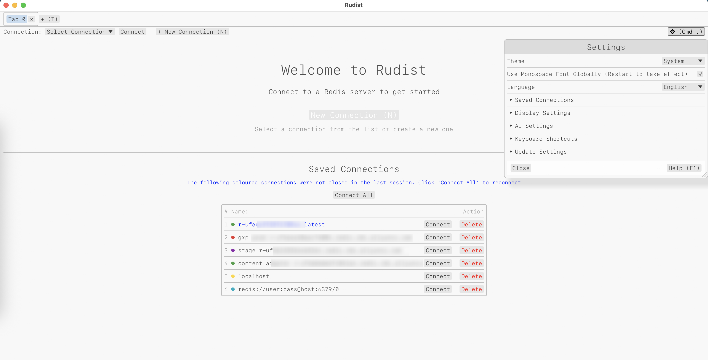
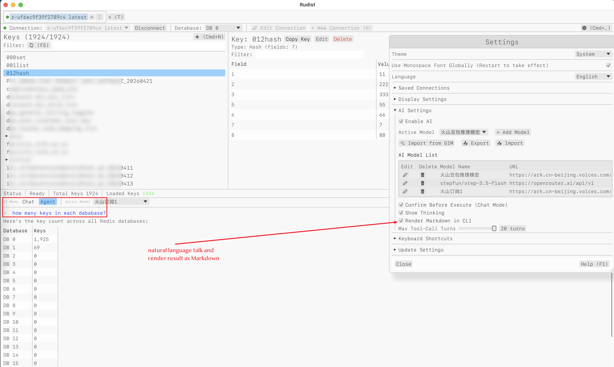
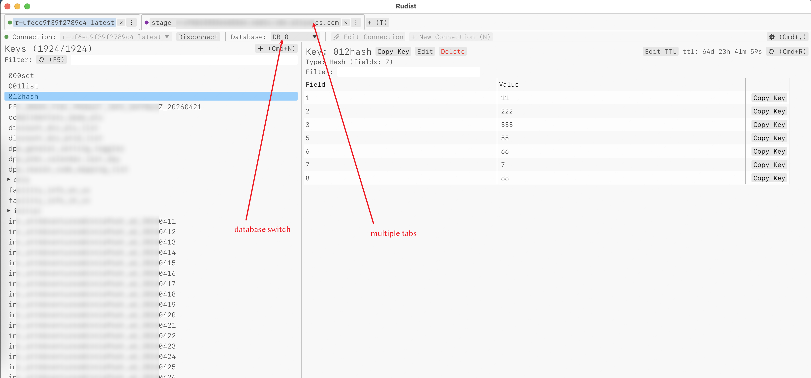
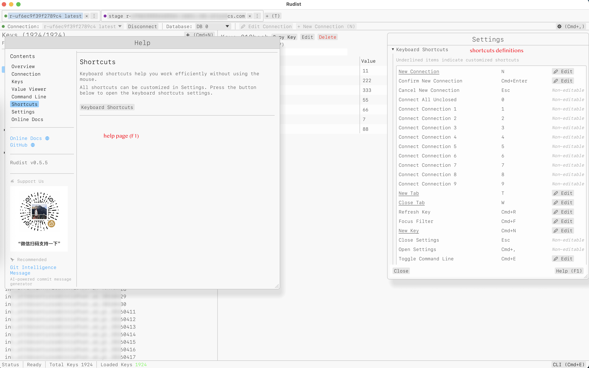

# Screenshots

## Welcome Page

The welcome page appears when you first launch the application, providing quick access to create new connections or open existing ones.

## AI Agent Interface

The integrated AI agent helps you interact with Redis using natural language, automatically generating Redis commands and explaining results.

## Key List View

Browse all Redis keys in a tree-like structure, with support for filtering, sorting, and bulk operations.

## Help Page

Access comprehensive documentation, keyboard shortcuts, and support resources directly within the application.
